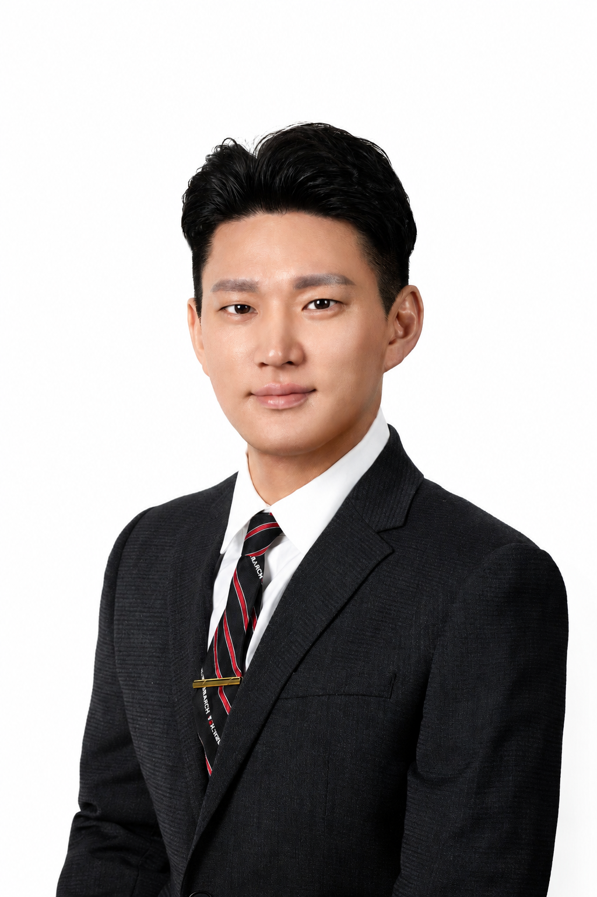

Gyusang (Kevin) Hwang

Ph.D. Candidate

Tourism & Hospitality Management

Temple University

<i class="bi bi-geo-alt"></i> Philadelphia, PA

<a href="cv.qmd">
<i class="bi bi-file-earmark-pdf"></i>
Curriculum Vitae
</a>

<a href="https://scholar.google.com/citations?user=I3JPPaQAAAAJ&hl=en"
   target="_blank" rel="noopener noreferrer">
<i class="bi bi-mortarboard"></i>
Google Scholar
</a>

<a href="https://orcid.org/0009-0008-3667-0854"
   target="_blank" rel="noopener noreferrer">
<i class="bi bi-person-badge"></i>
ORCID
</a>

<a href="https://www.linkedin.com/in/kevin-gyusang-hwang/"
   target="_blank" rel="noopener noreferrer">
<i class="bi bi-linkedin"></i>
LinkedIn
</a>

<a href="mailto:gyusang.hwang@temple.edu">
<i class="bi bi-envelope"></i>
Email
</a>

