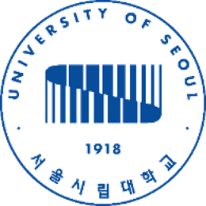
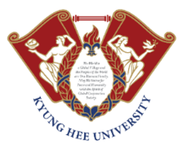
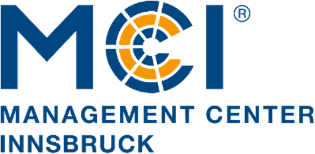
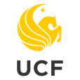

::::: {.site-layout}

:::: {.profile-column}



::::

:::: {.main-column}

# Gyusang (Kevin) Hwang

I am Gyusang (Kevin) Hwang, a Ph.D. Candidate in Tourism & Hospitality Management at Temple University's Fox School of Business. My academic work reflects an integrated pipeline of industry experience, research, and teaching. Professional experience across business travel and MICE, mega-events, and hospitality operations informs the questions I examine; I investigate these questions using large-scale data, econometrics, and spatial analytics; and I bring these perspectives back into the classroom through applied, industry-relevant teaching.

## Academic Background

:::: {.background-section}

::: {.background-item}

{.background-logo-img}

**Temple University**  
Ph.D. in Business Administration · Tourism & Hospitality Management  
Fox School of Business · School of Sport, Tourism and Hospitality Management · Temple Presidential Fellow · 2023–2027

:::

::: {.background-item}

{.background-logo-img}

**University of Seoul**  
M.S. in Urban Sociology  
Seoul, South Korea · 2020–2023

:::

::: {.background-item}

{.background-logo-img}

**Kyung Hee University**  
B.S. in Convention Management & Business Administration  
Seoul, South Korea · 2011–2019

:::

::: {.background-item}

{.background-logo-img}

**Management Center Innsbruck**  
Exchange Student · Department of Tourism  
Innsbruck, Austria · 2016

:::

::: {.background-item}

{.background-logo-img}

**University of Central Florida**  
Exchange Student · Rosen College of Hospitality Management  
Orlando, Florida · 2015

:::

::::

## Professional Experience

:::: {.background-section .professional-section}

::: {.background-item}

{.background-logo-img}

**Hyundai Dream Tour**  
Assistant Manager  
MICE · Chartered Flights · Strategic Sales · 2018–2021

:::

::: {.background-item}

{.background-logo-img}

**PyeongChang 2018**  
Project Manager · Accreditation  
Olympic & Paralympic Games Organizing Committee · 2016–2018

:::

::: {.background-item}

{.background-logo-img}

**Walt Disney World Resort**  
Intern · Magic Kingdom Park  
Orlando, Florida · 2015

:::

::: {.background-item}

{.background-logo-img}

**LEE Convention Co., Ltd.**  
Research Intern  
Busan, South Korea · 2014

:::

::::

::::

:::::